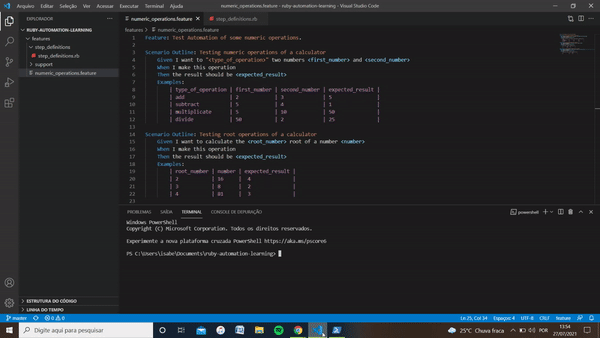
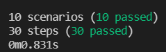

# 👨‍💻 Test Automation of a calculator using Ruby, Cucumber and RSpec

Ruby, Cucumber and RSpec test automation of the functionalities of a calculator, including addition, subtraction, multiplication, division, root and exponencial. 

The features of the tests are inside `ruby-automation-learning/features/numeric_operations.feature` and the step definitions are inside `ruby-automation-learning/features/step_definitions/step_definitions.rb`

## 🎥 Tests Execution Demonstration



## 💾 Development Dependencies Used

- "Ruby":  "3.0.2"
- "Cucumber": "7.0.0"
- "RSpec": "3.10"

## 🎬 Getting Started

1. Clone the project into your machine and install all dependencies described above:

```console
bundle install
```

2. Now, to run the tests:

```console
cucumber
```

3. Verify the tests results output:



---

Made by Isabela Beck 👋 [Get in touch!](https://www.linkedin.com/in/isabelabeck/)
